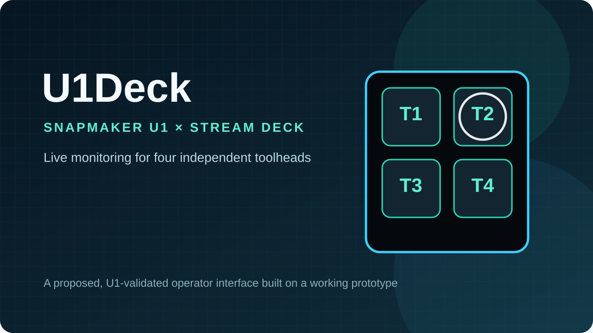
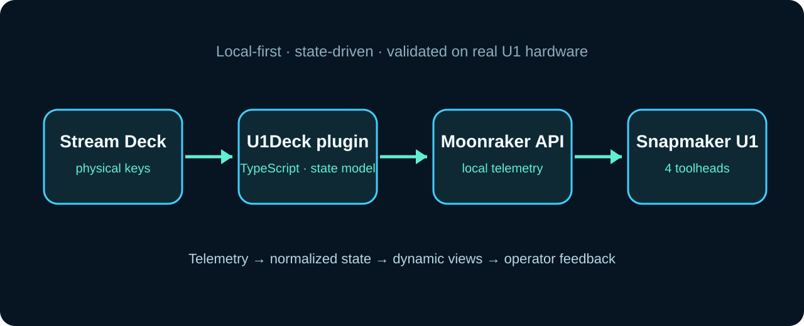

# U1Deck

## A dedicated Stream Deck interface for Snapmaker U1

U1Deck is a proposed Stream Deck integration designed specifically for the Snapmaker U1: a glanceable, local-first interface for monitoring its four independent toolheads and the complete print workflow.

U1Deck is not presented as a completed U1 product today. It is the next development project built on the working BambuDeck prototype, already demonstrated on real hardware with a Bambu Lab P1S + AMS.

> **The request:** access to a Snapmaker U1 so the integration can be developed, debugged and validated against the real machine rather than assumptions.

  

## Why this project is different

Most U1 projects focus on slicing, conversion, firmware, CAD or hardware modifications. U1Deck focuses on the operator experience: making the U1's live state visible and understandable on a physical control surface beside the printer.

The project would provide a dedicated interface for:

- four independent toolheads and their active state;
- print progress, estimated time and current job information;
- nozzle, bed, chamber and environmental values;
- fan and speed information;
- filament and toolhead selection;
- warnings, unavailable states and safe recovery guidance;
- navigation between overview, toolhead and job-detail pages.

## Existing technical foundation: BambuDeck

BambuDeck proves the core interaction model on real hardware:

- local printer telemetry;
- state-driven Stream Deck keys;
- dynamic SVG interfaces;
- live progress and temperature visualisation;
- AMS colour display and active-slot highlighting;
- TypeScript and Elgato Stream Deck SDK v2;
- an intentionally monitoring-focused safety model.

### Working proof

[View the BambuDeck prototype and animated real-hardware demonstration](https://github.com/rmncld/BambuDeck)

BambuDeck currently reads printer data. The chamber light is the only direct command implemented in the demonstrated prototype.

## Proposed U1 architecture

  

The proposed integration would use the U1's supported software stack and local interfaces:

1. Stream Deck presents the selected U1 view.
2. A TypeScript plugin maintains the local connection and normalizes printer state.
3. Moonraker provides the printer API and live status path.
4. U1-specific adapters expose the four-toolhead workflow in a consistent model.

The exact endpoints, permissions and command scope would be validated on the supplied U1 before implementation claims are made.

## Planned interface

### Overview page

One glance should answer: Is the U1 connected? Is it printing? Which toolhead is active? How far has the job progressed? Is attention required?

### Toolhead detail

Each of the four toolheads would have an identifiable state, temperature information, material context and active/inactive indication, with clear handling for unavailable or unloaded tools.

### Print and job detail

The project would explore file name, progress, layer information, estimated remaining time, current phase and relevant warnings where the U1 API makes those values available.

### Safe controls

Monitoring comes first. Any future control would require explicit validation of the U1 API, failure states and confirmation behaviour. No control is claimed until it has been tested safely on the actual machine.

## Development plan

| Phase | Goal | Evidence |
| --- | --- | --- |
| 1 · Discovery | Map U1 telemetry, Moonraker endpoints and four-toolhead states | API notes and state model |
| 2 · Foundation | Establish local connection and connection-status view | Working U1 connection |
| 3 · Monitoring | Build overview, progress, temperatures and toolhead pages | Recorded real-U1 demonstration |
| 4 · Refinement | Add warnings, navigation, layouts and documentation | Reproducible public showcase |
| 5 · Validation | Test long prints, tool changes and failure/recovery states | Test report and release scope |

## Openness and contribution

The public project will document the architecture, supported behaviour, setup requirements and test results. The proprietary BambuDeck implementation is used as the technical foundation, while U1-specific behaviour will be documented transparently as it is validated.

Feedback from U1 users will directly inform which views are most useful in daily operation.

## Project status

| Confirmed | Proposed | Requires U1 validation |
| --- | --- | --- |
| BambuDeck working prototype | U1 overview page | Exact Moonraker data paths |
| Stream Deck integration model | Four-toolhead detail views | Tool-change state handling |
| Local-first monitoring approach | U1 job and warning pages | Safe command boundaries |
| Real-hardware demonstration method | Configurable layouts | Long-print reliability |

## Support requested

The project requires access to a Snapmaker U1 for meaningful development. A real machine would allow the integration to be built around observed telemetry, tool changes and recovery states, with results documented for the U1 community.

## Independence

U1Deck is an independent project proposal. It is not affiliated with, endorsed by or sponsored by Snapmaker. Snapmaker and U1 are trademarks of their respective owners.
